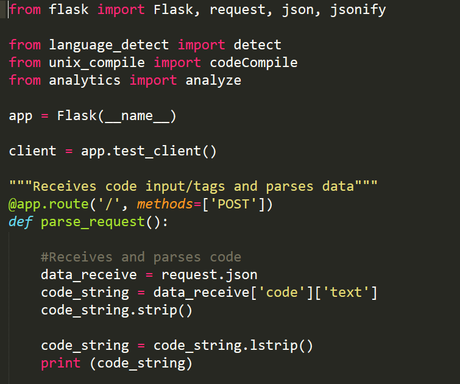

When I was younger, around 7 or 8, I was learning how to write elaborate essays.  However,  English was not my strongest suit, so the topic was completely lost on me.  There were books and documents supplied in hopes I would understand, but that failed.  My mom decided to introduce a new way of learning to me: the computer.  I had seen one, but I had never used it.  My opinion of a computer started when she had me play learning games to improve my skills in certain subjects.  To me, a computer is a piece of machinery that we co-depend on.  I say this because the computer depends on us to give certain commands so it can run programs properly, while we depend on the computer to figure out the more technical aspects that we cannot comprehend (hi-level versus low-level).   

Coming to the conclusion of majoring in Computer Science is not what the typical person would expect.  In fact, I had no thought of doing this major, nor did I even know what coding was in the past.  I was originally going to dance for a couple of years and go to college later so I could study medicine and become a surgeon.  Unfortunately, I injured myself to the point where I couldn’t dance anymore, and my career flew out the window, not to mention my new appearing fear of the sight of blood (I could not become a surgeon under these circumstances).  I was in senior year of high school, and I needed to find out what my future plans were before I graduated.  Once again, my mom indirectly came to the rescue, having taken a basic coding class at Devleague and making me do the same.  I picked up the logic fast, and I was able to successfully make websites and simple programs quickly in Javascript.  Therefore, I had decided on my major.

In conclusion, computers are important aspects of our everyday lives, whether we are using one or we aren’t.  Computers are connected with everything a person uses, whether it is something technical like a program or a normal item such as a tube of toothpaste.  Without computers, it would be very hard for anyone to survive in the modern day.
