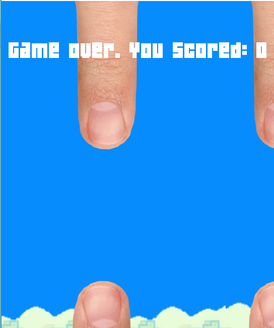

## What was your first opinion on Semantic UI?

I am a person who doesn't always like change.  I had used Bootstrap in the past, and I was used to the way it was styled.  When Semantic UI was introduced, I was automatically terrified.  I did want to learn something new, but at the same time I was afraid I would have a hard time figuring out the language (it took me about a month to get used to Boostrap, and I still have some issues with it).  It also constantly confuses me to wrap many elements within each other.  If I miss even one closing tag in a nested div:

```<div class ="footer-background">
  <div class="ui centered fixed horizontal list">
    <div class="item">
      <div class="content">
        <div class="header">Pro</div>
      </div>
    </div>

    <div class="item">
      <div class="content">
        <div class="header">|</div>
      </div>
    </div>
</div>
```

I already know I will either struggle and consume time trying to figure out where the last tag goes, or I will give up because I know it is a lost cause.  However, one thing I like about Semantic UI is that you can automatically say the direction you want a certain element to go in (i.e., insert "right", "left", etc. in the div class).

## How can you compare raw HTML and CSS to Semantic UI?


//https://i2.wp.com/blog.fossasia.org/wp-content/uploads/2017/06/semantic.png?fit=756%2C476&ssl=1

Coming to the conclusion of majoring in Computer Science is not what the typical person would expect.  In fact, I had no thought of doing this major, nor did I even know what coding was in the past.  I was originally going to dance for a couple of years and go to college later so I could study medicine and become a surgeon.  Unfortunately, I injured myself to the point where I couldn’t dance anymore, and my career flew out the window, not to mention my new appearing fear of the sight of blood (I could not become a surgeon under these circumstances).  I was in senior year of high school, and I needed to find out what my future plans were before I graduated.  Once again, my mom indirectly came to the rescue, having taken a basic coding class at Devleague and making me do the same.  I picked up the logic fast, and I was able to successfully make websites and simple programs quickly in Javascript.  Therefore, I had decided on my major.

## Final Comments:



In conclusion, computers are important aspects of our everyday lives, whether we are using one or we aren’t.  Computers are connected with everything a person uses, whether it is something technical like a program or a normal item such as a tube of toothpaste.  Without computers, it would be very hard for anyone to survive in the modern day.
