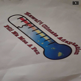

  

The CTE PBA is an annual competition.  However, the real goal was to get the CTE honors for graduation.  In order to fill this requirement, a test has to be passed, an essay written, and you must compete in this competition, each section scored.  People from many different schools compete in different categories (ex: culinary, graphics, digital media, etc.).  I did graphic design with two other teammates: Talia Fix McNamara and Spencer Lee. 

In my category, we were to stay at a hotel for two nights.  Against 16 other teams, we had one night to make logos for DLNR in relation to environmental issues.  During that time, we also had to make a PowerPoint presentation and submit it on the same day.  From there, we stayed up all of the second night to prepare for the interview with the DLNR associates the following morning.  We won the competition in our category and our logos went to DLNR for their use.

I learned to never give up.  Although this might sound like an overused statement, I have my reasons.  My teammates and I got food poisoning (along with others), and we had to endure that while doing the interview.  It was torture, but we had gone too far and worked so hard that our determination won out.  I also learned how to do interviews and to get my nerves out, so I can be more confident when interacting with others in general.
