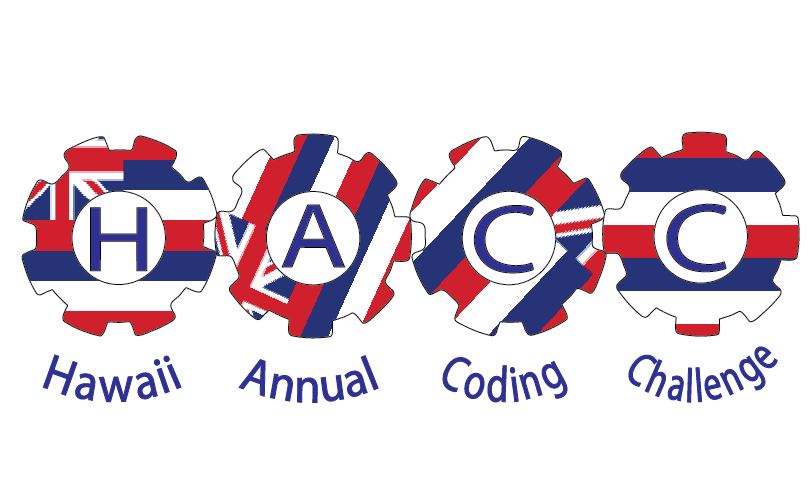

  The HACC (Hawaii Annual Coding Challenge) is a statewide hackathon that addresses the issues of Hawaii. These issues need to be able to be fixed by technology (ex: finding a way for people to communicate with their relatives in prison).  Most people form large groups, since this hackation is an entire month long.  The Governor put State CIO Todd Nacapuy in charge of the event, whom I interned for in the summer.  

  During this internship, I was involved in the HACC.  I was given the task to redo the logo for the HACC.  The CIO knew that I had advanced experience in graphic design, and I was allowed to use anything I wanted, as long as nothing was copyrighted and the logo was appropriate for use. 
  
  From this experience, I repolished the skills I was rusty on in Adobe Illustrator.  I was able to regain certain techniques that I lost, such as tracing objects quickly with precision, blurring certain parts out, and using the smooth tool to smooth out the edges that are not supposed to be sharp.  I also understood that similar to the State, I also had very narrow time constraints, and I had to get the logo out in time.
