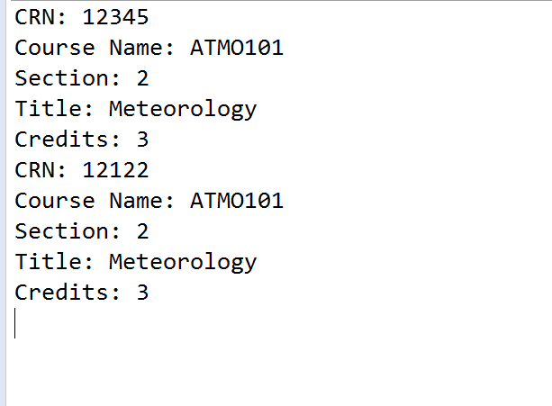

  

Schedule is a UHM project that can show the courses you are currently taking at the time.  It will show the CRN and the section you are in.  It will also show the title of the actual class (so you know what type of course you are taking).

