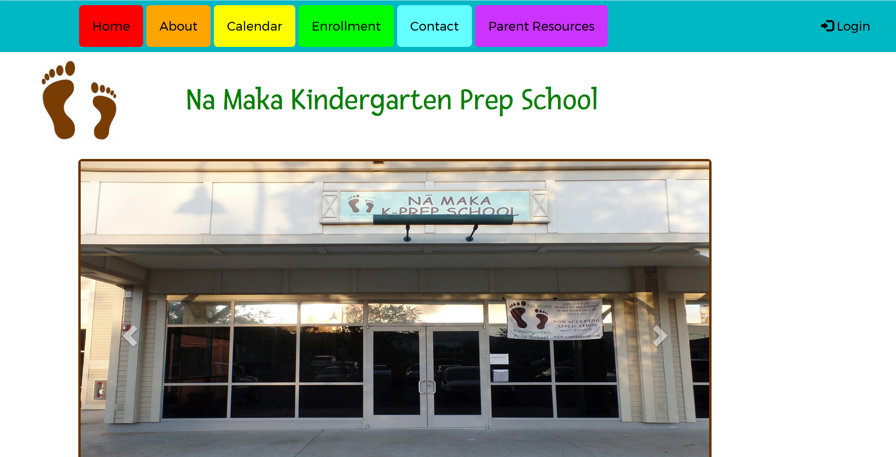

NamakaKPrep is a website for a school.  I collaborated with two other students, Trevin Tejero and Tyler Chong.  My job was to work on the front-end (styling and adding the HTML).  Unfortunately, it has not been published, therefore there is no site to go to at the moment.
