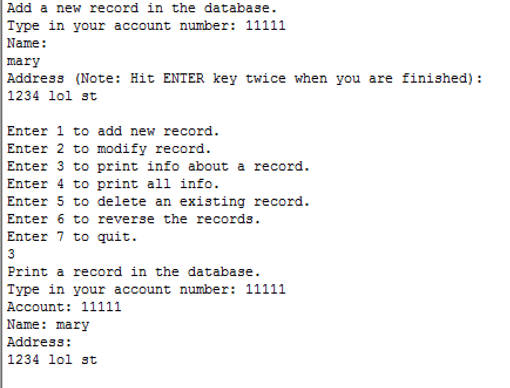

  

Address book is a C++ project that will allow you to create a database of contacts.  Each contact includes the name, account number, and address.  You are allowed to add records, delete records, modify records, print a record based on account number, print all records, and exit the program when you are finished.
