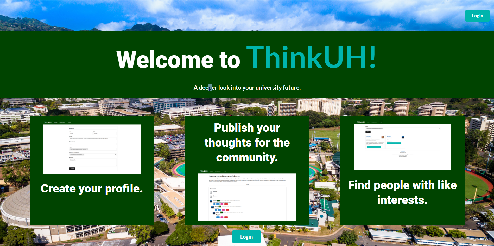

Organization Github Page: <a href="https://github.com/thinkuh"><i class="github icon"></i>ThinkUH</a>

ThinkUH is an [app](https://thinkuh.meteorapp.com/) that me and two others have created in a team for our ICS 314 final project.  This was designed specifically for each pathway to find out the prerequisites of their courses, the professors teaching each class, and ways to interact with former and current students. 

Because this was a project that would take a lot of time, we decided to begin with the ICS pathway, since we already know most of the classes that must be taken in order to graduate.  It wasn't the first time I worked in a group, but it was interesting to see the thought process of my two other team members while doing the project.  During class, we always did a new mockup on the whiteboard to reroute or continue from where we completed each task, and that also took careful planning.

I learned quite a lot of things from this project.  For one, I somehow keep getting unlucky with illness, because one member and I fell very ill during the first couple most important days of Milestone 1, although we tried our best to work through it.  Besides learning to work through any obstacle, I also learned to speak up, because that is the only way your ideas will be heard and implemented in the project.  Finally, I learned how to do a larger project than normal, as most hackathons are a day long.
